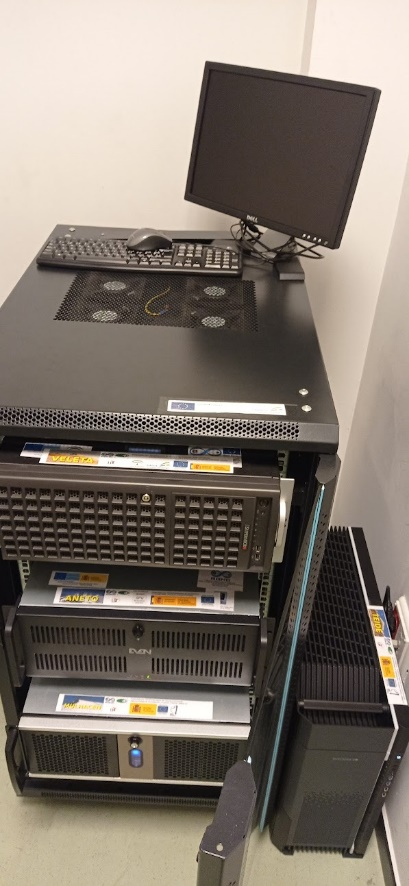

# GPU MINI-CLUSTER AT RESEARCH GROUP on NATURAL COMPUTING

## 0. Contents

1.  [Description](#1-description)

2.  [Client configuration](#2-client-configuration)

3.  [Access](#3-access)

4.  [Working in a node](#4-working-in-a-node) (link to the [**scheduler**](https://docs.google.com/spreadsheets/d/1APrUew3SSMiXYqRIpJWibmvGCGiTY1EvyZdHEr28Wn8/edit?usp=sharing))


## 1. Description

Our mini-cluster is located at the Higher Technical School of Computer
Engineering facilities, next to our Department of Computer Science and
Artificial Intelligence. It is currently composed of **4** servers,
named after the highest peaks of Spain: **Teide** (3715m, Canary Islands),
**Mulhacen** (3479m, Granada), **Aneto** (3404m, Huesca), **Veleta** (3396m,
Granada). The specifications are detailed at
<http://www.gcn.us.es/gpu_computing_servers>. This is a picture of the
servers taken in May 2022:



The configuration is the following:

-   **Veleta** server can be openly accessed through a public IP of the
    university of Seville (we can give you the *IP address if you
    collaborate with us*, and you should have received it in the email
    with the credentials). It has three GPUs, two of them no longer
    supported in CUDA 12, so it will remain with CUDA 11.

-   **Aneto** server is hidden behind Veleta server in a private
    network. Unfortunately, this server has hardware issues and it is
    unavailable. Hard drives and GPUs were moved to Veleta.

-   **Mulhacen** server is hidden behind Veleta server in a private
    network. It has two GPUs.

-   **Teide** server is hidden behind Veleta server in a private
    network. It has two GPUs.


## 2. Client configuration

If you want to access each node by its name from your computer, do the
following.

You should have Openssh Client in your operating system:

-   in Linux/Ubuntu: ```bash sudo apt install
    openssh-client``` (or search openssh in your distribution)

-   in Windows: install [Openssh Client
    feature](https://docs.microsoft.com/en-us/windows-server/administration/openssh/openssh_install_firstuse),

You should have a folder ```bash $HOME/.ssh``` in your
home directory (in your computer). If not, please create it:

```bash mkdir $HOME/.ssh```

Next, backup your ```bash $HOME/.ssh/config``` file if it exists already,
by executing:

```bash cp $HOME/.ssh/config $HOME/.ssh/config.backup```

If this config file doesn’t exist, just
continue with the next steps.

Next, download the config file from these links (depending on your
operating
system): [linux ](https://github.com/RGNC/gpucomputing/blob/master/config/linux/config) or [windows](https://github.com/RGNC/gpucomputing/blob/master/config/windows/config).
Copy the file to your ```bash $HOME/.ssh``` folder. If
you had a config file previously, simply copy the contents to your
existing file.

Please, edit the ```bash $HOME/.ssh/config``` file with
your favourite editor, and replace **GPU-RGNC** by the public IP of our
server, and **USER** by the username given to you in the mini-cluster
(you should have received by email). Moreover, delete the comment (text
after \#) in those two lines (third and fourth line in the example
below). At the end, you should have something like this (for example):

```bash
### First jumphost. Directly reachable
Host veleta
   HostName **someservername.cs.us.es**
   User **gheorghepaun**
   ProxyCommand none
   ForwardAgent yes
   GSSAPIAuthentication no

### Host to jump to via veleta
Host aneto
   HostName aneto
   ProxyCommand ssh veleta -W %h:%p
   ForwardAgent yes
   GSSAPIAuthentication no

### Host to jump to via veleta
Host mulhacen
   HostName mulhacen
   ProxyCommand ssh veleta -W %h:%p
   ForwardAgent yes
   GSSAPIAuthentication no

### Host to jump to via veleta
Host teide
   HostName teide
   ProxyCommand ssh veleta -W %h:%p
   ForwardAgent yes
   GSSAPIAuthentication no
```

If you don’t want to enter your password twice when accessing Teide,
Mulhacen or Aneto through Veleta, execute the following lines in your
machine by simply replacing replace **USER** with your username given in
the mini-cluster (if you are a Windows user, please see the note below):

1.  ```bash ssh-keygen -t rsa -b 2048```   (press enter
    for all the prompted questions)

2.  ```bash ssh-copy-id USER@veleta```   (insert your
    password all the required times)

3.  <s>```bash ssh-copy-id USER@aneto```   (insert your
    password all the required times)</s>

4.  ```bash ssh-copy-id USER@mulhacen```   (insert your
    password all the required times)

5.  ```bash ssh-copy-id USER@teide```     (insert your
    password all the required times)

Try for example ```bash ssh **USER**@mulhacen```, and check that you are
requested only once for your password.

Note: For Windows users, ssh-copy-id does not exist, so you have to use
an alternative such as
[this](https://chrisjhart.com/Windows-10-ssh-copy-id/) or
[this](https://gist.github.com/nickbayley/ef2b6744b976c96db6e9).


## 3. Access

If you have configured your ssh client as in previous section, you can
access to each node independently. So, depending on the server (replace
**USER** by your username in the mini-cluster):

-   Access to Veleta: ```bash ssh
    USER@veleta```

-   <s>Access to Aneto: ```bash ssh
    USER@aneto```</s>

-   Access to Mulhacen: ```bash ssh
    USER@mulhacen```

-   Access to Teide: ```bash ssh
    USER@teide```

Once you have accessed to the desired server, you can run your programs
remotely. If you need to copy files to and from the servers, do the
following (replace **USER** by your username and **NODE** by your
desired node, either veleta, aneto, mulhacen or teide):

-   Copy a file to a NODE: ```bash scp YOUR\_FILE
    USER@NODE:```

-   Copy a file from a NODE: ```bash scp
    [USER@](mailto:username@teide)NODE:YOUR\_FILE .```

-   Copy a folder to a NODE: ```bash scp -r YOUR\_FOLDER
    USER@NODE:```

-   Copy a folder from a NODE: ```bash scp -r
    [USER@](mailto:username@teide)NODE:YOUR\_FOLDER .```

Please, keep using the password that you were given, or change it by
another secured password. DO NOT use as password same your username,
or this kind of bad practices, since we are receiving lot of external
attacks. In order to change the password, please execute
```bash passwd``` in each server (we don’t have a
centralized user directory for the moment).


## 4. Working in a node

### 4.1 Book a time slot for your work

Given the high demand we have for our GPUs, please select a time slot in
our
[**scheduler**](https://docs.google.com/spreadsheets/d/1APrUew3SSMiXYqRIpJWibmvGCGiTY1EvyZdHEr28Wn8/edit?usp=sharing)
and book a GPU (or GPUs) for you. It is super-easy, just go to a GPU
that you have access to, go to the day (row) and time (column) of your
desire, and write your username to the hours you plan to use it. Please,
be responsible and do not reserve the GPUs more than you expect to need
(e.g. no more than two days in a row). Moreover, do not delete a
reservation made by other user. We trust on the good behaviour of the
users. In case you are having problems with other users, please notify
the <a href="https://miguelamda.github.io/">administrator</a> with the subject: \[GPU at RGNC\] USER REPORT,
and explain the situation.

This is a temporary solution while we have a high demand, it can be
replaced in the future with SLURM, tensorhive or something similar.
Moreover, bear in mind that the RGNC can lock GPUs for research
purposes. Required management time will be shown in the spreadsheet well
in advance.

You do not need to reserve a GPU when your work is CPU only, e.g.:
compilation, coding development, scripting, python and DL with CPU only,
etc. Also note that other users might consume all RAM memory when using
one GPU only. If this happens and you have booked the other GPU in the
system, please report to mdelamor.

### 4.2 Selecting your GPU

Once you are logged in a node, you can check which GPUs are available
and their status typing: 

```bash nvidia-smi``` 

Please,
double check that your booked GPU is idle. The outcome of the
instruction should be something as follows:


In the example above, the first GPU is busy and 14GB is being used,
while the GPU 1 is idle. You can see at the bottom of the output the
processes using the GPUs. In the example, only one process is using GPU
0. In theory you can launch more than one process to the same GPU, as
long as they fit in the memory. In any case, please try to avoid it,
since the GPUs can be used for benchmarking, and this can affect
performance.

By default you are given GPU number 0. In order to select a different
GPU, or you want to use GPU number 1, type: 

```bash export CUDA\_VISIBLE\_DEVICES=1```

If you want to use both GPUs, type:

```bash export CUDA\_VISIBLE\_DEVICES=0,1```

If you want to use GPU number 0 again, type: 

```bash export CUDA\_VISIBLE\_DEVICES=0```

### 4.3 Storage

All servers should have enough storage for your needs, but please check
that home or / is not full by executing ```bash df -h```.
If you are using a large dataset, or you have lot of data, please
consider moving it to the <span class="mark">/data</span> partition
(Veleta, Mulhacen and Teide only). This partition has lot of space (1TB
in Mulhacen and 2TB in Teide, Veleta has no such partition yet).

### 4.4 Selecting your compiler / development kit

We use **CVMFS** in all nodes for accessing different compilers and
libraries versions. This is a CERN virtual file system with lot of
development tools compiled for Red Hat based systems (CentOS,
RockyLinux, AlmaLinux…). All our servers run Rocky Linux 9. In order to
use cvmfs, do the following:

1.  ```bashls /cvmfs/sft.cern.ch/lcg/releases``` (this
    will mount the remote file system, and you will see all tools
    available, it is a long list)

2.  For instance, if you want to use another version of *gcc* than the
    default one, select your version:

    -   First, execute ```bash ls /cvmfs/sft.cern.ch/lcg/releases/gcc``` to see all available
        versions.

    -   Select a version with a subfolder with centos9 (although centos7
        usually works good as well).

    -   For example, assume you want to use GCC 11.3.1, then just
        type:  
        ```bash source /cvmfs/sft.cern.ch/lcg/releases/gcc/11.3.1/x86\_64-centos9/setup.sh```

3.  Some other libraries instead of requiring a source file, just need
    to adjust your $PATH or your $LD\_LIBRARY\_PATH to that folder (for
    example for cmake)

You can check which are the available CUDA versions installed by running
<span class="mark">ls -l /usr/local</span>.

We recommend using CVMFS for development, and python pip or conda for
Machine Learning. If you need other software to get installed, and admin
credentials are need, please email to mdelamor ‘at’ us.es with the
subject \[GPU at RGNC\] SOFTWARE INSTALL.

### 4.5 Launching Jupyter Notebook for Python/Deep Learning

Both Jupyter Notebook and Lab are installed in all nodes. If you need to
execute a remote **Jupyter notebook** environment, then do the following
(replace **USER** by your username and **NODE** by your desired node,
either veleta, aneto, mulhacen or teide):

1.  Type in your machine: ```bash ssh -L 8888:localhost:8888  USER@NODE```

2.  In the node you chose, type: ```bash jupyter notebook --port=8888 --no-browser```
    Copy the URL with the token shown at the end.

3.  Now in your browser, paste the URL you copied before.

If more than one user is using Jupyter notebook in the same server, **please change
your port** in the lines above (instead of 9999, use e.g. 8889, 8890, 8891, etc.). Finally,
anaconda is installed in our severs (though the
```bash conda``` command), in case you need to install a
custom configuration. Please keep it at minimum since the disk space is
limited, so consider using *miniconda* instead.

### 4.6 Remote development with NVIDIA Nsight Visual Studio Code

It is possible to use Remote Explorer plugin of NVIDIA Nsight Visual
Studio in our servers. You will need to configure .ssh/config file from
your active terminal in Visual Studio Code, as explained above. In this
way, Visual Studio Code will find our servers. If you use WSL, please
do the configuration in Windows, so that VS code will take the ssh 
configuration from here.


Have fun, and wish you an efficient code!


-------
v9.0, 06-09-2025

<a href="https://miguelamda.github.io/">Miguel Ángel Martínez del Amor</a>,  
Research Group on Natural Computing  
University of Seville

This README was generated with pandoc
